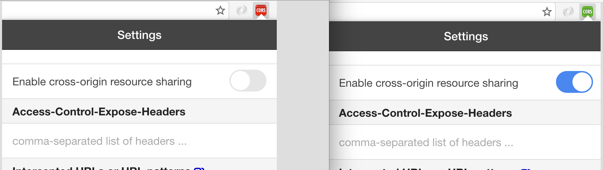

PI JQuery AJAX JSON Example
===========================

Note: You will likely need to install this Chrome Plugin which will allow you to request AJAX from any site:
https://chrome.google.com/webstore/detail/allow-control-allow-origi/nlfbmbojpeacfghkpbjhddihlkkiljbi

Once installed you will be able to toggle easily:

It will likely need to be turned on (green icon) to work.

Basic Setup
-----------
We'll start with the basics:
* index.html
* scripts/jqueryAjaxJsonExample.js
* scripts/vendors/scripts/vendors/jquery-3.0.0.min.js

Source the js files in the html. Be sure to source the JQuery file prior to your script.

In our js file we'll only be doing a few things to start:
* retrieve data from JSON (getStudents function)
* display retrieved data (displayStudents function)

At the top of the file we'll create a global array for the students data retrieved as well as a jsonURL string in which we'll hold the URL for the JSON file.

Next Steps
----------
Once the project is working, a few food for thought extensions you may which to try:
* remove a students from the array/DOM
* add the ability to edit students in the array and update the DOM
* display only one student at a time with "next"/"prev" button that allow you to cycle through
* when cycling through records, wrap around ("next" when on the last record wraps to show the first and vice-versa)
* display the number of the currently shown student as well as the total
* whatever else your little heart may desire! Go Nuts with it and show us your skillllllzzzzzzz!
